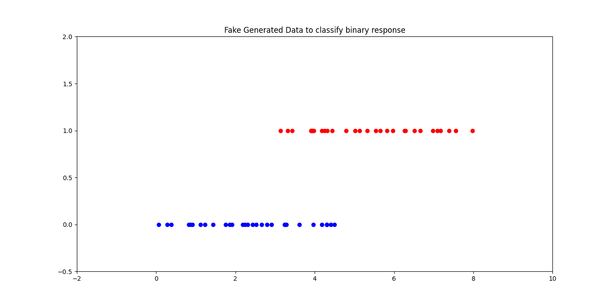
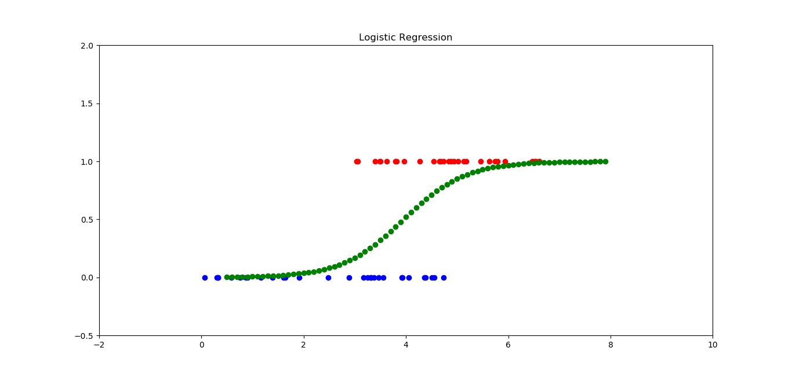
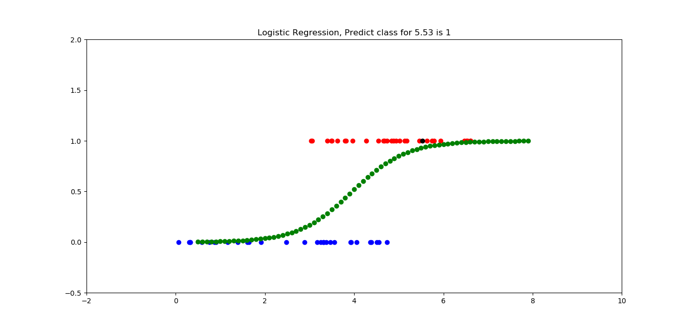
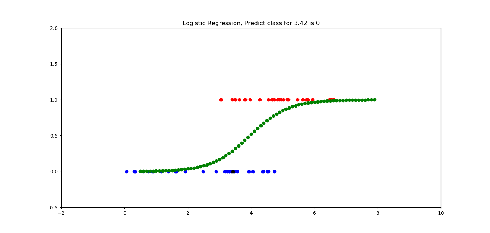
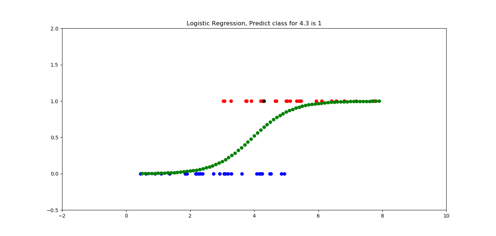

```
.
├── figures
│   ├── Figure_1.png
│   ├── Figure_2.png
│   ├── Figure_3.png
│   └── Figure_4.png
├── README.md
├── run.py
├── utils
│   ├── data.py
│   ├── __init__.py
│   ├── model.py
│   └── plot.py
└── weights
    └── LogReg-6a82p.pkl
3 directories, 11 files

```

```text
usage: run.py [-h] [--load LOAD]

optional arguments:
  -h, --help   show this help message and exit
  --load LOAD  True: Load trained model False: Train model default: True
MSE 3.766020984227096
R^2 value: 0.8833333333333333
b_0: 1.6609947334733783 
b_1: -6.564698790751537
Do you want to save the model weight? yes
Model saved at weights/LogReg-6a82p.pkl
```

### Train the model
```shell
python run.py
python run.py --load 0
```

### Load the weight model
```shell
python run.py --load 1
```

### Training process
```text
usage: run.py [-h] [--load LOAD]

optional arguments:
  -h, --help   show this help message and exit
  --load LOAD  True: Load trained model False: Train model default: True
MSE 3.766020984227096
R^2 value: 0.8833333333333333
b_0: 1.6609947334733783 
b_1: -6.564698790751537
Do you want to save the model weight? yes
Model saved at weights/LogReg-6a82p.pkl
```







### Docker for Logistic Regression

## Build Docker image
You can build Docker image by following:
```shell script
docker-compose build
```

## Run Docker container
You can launch a container from the Docker image by following:
```shell script
docker-compose up
```

